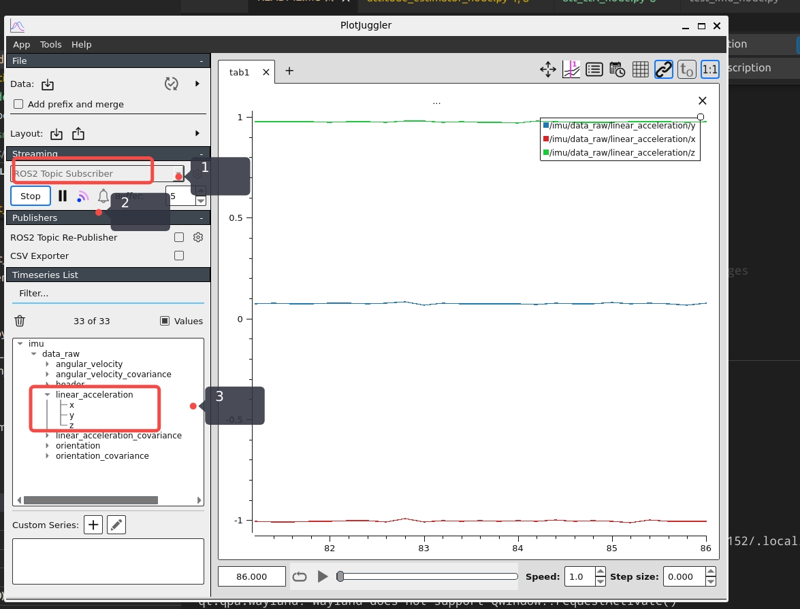

# flying_robot_ros
飞鼠机器人ROS节点与功能实现

## test
### test_imu

https://github.com/facontidavide/PlotJuggler

install
```bash
sudo snap install plotjuggler
sudo apt install ros-humble-plotjuggler-ros

sudo apt install libcanberra-gtk-module libcanberra-gtk3-module
sudo apt install ros-humble-rviz2
sudo apt-get install ros-humble-imu-tools
```

run 
```bash
plotjuggler


unset GTK_PATH
rviz2
```

按照图中的顺序，把liner_acceleration + angular_velocity 波形拖动到右边就可以实时显示了。



# cmd
```bash
conda deactivate
conda activate ros2
colcon build

source install/setup.bash

sudo rosdep init
rosdep update
rosdep install --from-paths src --ignore-src -r -y

ros2 run my_test hw_node
ros2 run imu_complementary_filter complementary_filter_node
ros2 run my_test IMU_subscriber

ros2 topic echo /imu/data

rm -rf build install log
```

## run
```bash
source install/setup.bash

ros2 run flying_robot_control hw_node

ros2 run flying_robot_control attitude_controller_node
```

## log
```bash
export RCL_LOG_LEVEL=DEBUG

export RCUTILS_CONSOLE_OUTPUT_FORMAT="[{severity} {time}] [{name}]: {message} ({function_name}() at {file_name}:{line_number})"
```